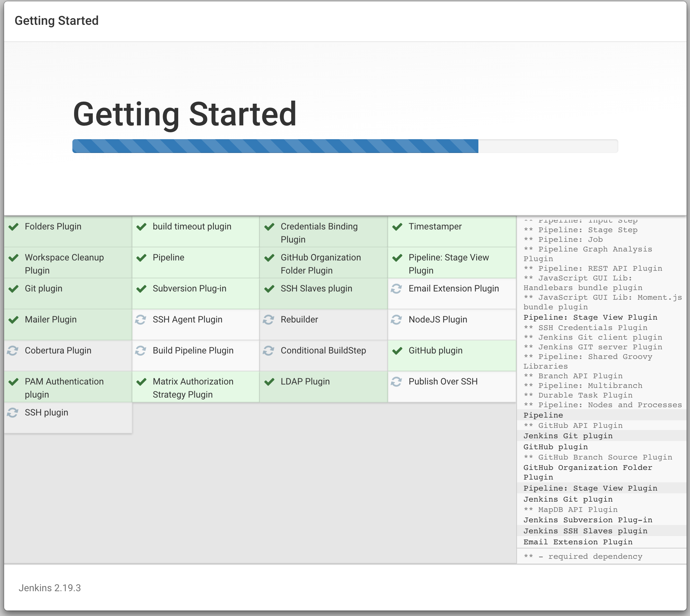

# DOCKER

#### DOCKER container for hosting the database

- Database: Mongodb
- Dockerfile: mongodb-docker-compose.yml

  ```
  cd tools && docker-compose -f mongodb-docker-compose.yml up
  ```

It reads docker-compose.yml and starts a container with Mongodb

### DOCKER container to host the jenkins:alpine for CI tasks

- Dockerfile configutation: https://hub.docker.com/r/library/jenkins/
- Persistent volume located at [b]./tools/docker-volumes/jenkins/[b]

  ```
  cd tools && docker-compose -f jenkins-docker-compose.yml up
  ```
- List of installed plugins



